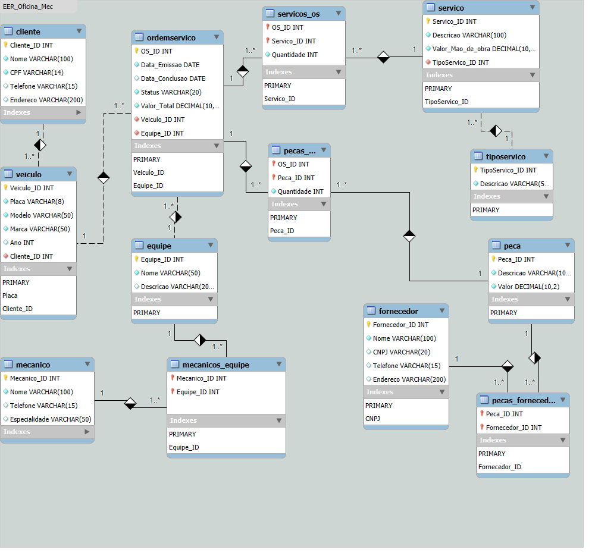

# Desafio 2: Modelagem e Implementação de Banco de Dados para Oficina Mecânica (Refatorado)

Este projeto é uma evolução do desafio de modelagem de banco de dados para uma oficina mecânica, parte do bootcamp inícialmente **[Suzano - Análise de Dados com Power BI]** mas agora tabém **Heineken - Inteligência Artificial Aplicada a Dados com Copilot** promovido pela em parceria com a [DIO](https://www.dio.me/). O objetivo deste desafio foi refatorar um esquema conceitual preexistente, adaptando-o para um esquema lógico, implementar o banco de dados `db_oficina`, popular com dados fictícios e criar consultas SQL complexas.

## Descrição do Projeto

O sistema visa controlar e gerenciar as ordens de serviço (OS) em uma oficina mecânica, abrangendo o cadastro de clientes, veículos, mecânicos, equipes, tipos de serviço, serviços, peças e fornecedores. O sistema também registra as peças utilizadas em cada OS, os serviços realizados e os mecânicos responsáveis, permitindo calcular o valor total de cada OS.

Esta versão do projeto representa a **implementação física** do banco de dados, incluindo:

*   Refatoração do esquema original para um esquema lógico otimizado.
*   Criação do banco de dados `db_oficina` no MySQL.
*   Scripts SQL para criação de tabelas, relacionamentos e restrições.
*   Scripts para inserção de dados fictícios para testes.
*   Queries SQL complexas que abordam diversos aspectos do banco de dados.

## Mudanças e Melhorias em relação ao modelo inicial

O modelo inicial foi reformulado, com as seguintes melhorias e adaptações:

*   **Chaves Primárias:** Todas as chaves primárias agora são do tipo `INT AUTO_INCREMENT` em vez de `VARCHAR`, o que facilita o gerenciamento e torna o modelo mais eficiente.
*   **Nomes de Colunas:** Os nomes das colunas foram padronizados e tornados mais descritivos (e.g., `Cliente_ID`, `Veiculo_ID`).
*   **Tipos de Dados:** Os tipos de dados foram ajustados para melhor refletir a natureza das informações (e.g., `VARCHAR(100)` para nomes, `VARCHAR(15)` para telefones).
*   **Remoção de Código de Mecânico:** A coluna `Código` na tabela `Mecanico` foi substituída por `Mecanico_ID`, que é uma chave primária auto-incrementável.
*   **Relacionamentos:** As chaves estrangeiras foram adequadas para referenciar os novos `ID`s, mantendo a integridade referencial.
*   **Banco de Dados:** O novo banco de dados criado foi nomeado de `db_oficina`.
*   **Scripts SQL:** Os scripts foram aprimorados para incluir a criação das tabelas, a inserção de dados fictícios, e as queries de consulta.

## Diagrama do Esquema Lógico (Modelo Relacional)

O diagrama a seguir representa o esquema lógico do banco de dados `db_oficina`, refletindo as mudanças e melhorias implementadas:

*Obs: O diagrama não é um arquivo em anexo. O nome dado foi para fins de facilitar o entendimento na localização do arquivo no seu projeto. Por exemplo, caso tenha salvo dentro de uma pasta chamada `assets` e dentro dela `images`, o endereço correto seria `assets/images/dEER_Oficina_Mec.png`*

Este diagrama demonstra a estrutura do banco de dados, as tabelas, seus atributos e as relações entre elas.

## Tabelas e Atributos

**Cliente:**
*   `Cliente_ID` (PK, INT, AUTO_INCREMENT)
*   `Nome` (VARCHAR(100))
*   `CPF` (VARCHAR(14), UNIQUE)
*   `Telefone` (VARCHAR(15))
*   `Endereco` (VARCHAR(200))

**Veiculo:**
*   `Veiculo_ID` (PK, INT, AUTO_INCREMENT)
*   `Placa` (VARCHAR(8), UNIQUE)
*   `Modelo` (VARCHAR(50))
*    `Marca` (VARCHAR(50))
*   `Ano` (INT)
*   `Cliente_ID` (FK, INT)

**Equipe:**
*   `Equipe_ID` (PK, INT, AUTO_INCREMENT)
*   `Nome` (VARCHAR(50))
*   `Descricao` (VARCHAR(200))

**Mecanico:**
*   `Mecanico_ID` (PK, INT, AUTO_INCREMENT)
*   `Nome` (VARCHAR(100))
*   `Telefone` (VARCHAR(15))
*   `Especialidade` (VARCHAR(50))

**Mecanicos_Equipe:**
*   `Mecanico_ID` (FK, INT)
*   `Equipe_ID` (FK, INT)

**TipoServico:**
*   `TipoServico_ID` (PK, INT, AUTO_INCREMENT)
*   `Descricao` (VARCHAR(50))

**Servico:**
*   `Servico_ID` (PK, INT, AUTO_INCREMENT)
*   `Descricao` (VARCHAR(100))
*   `Valor_Mao_de_obra` (DECIMAL(10,2))
*   `TipoServico_ID` (FK, INT)

**Peca:**
*   `Peca_ID` (PK, INT, AUTO_INCREMENT)
*   `Descricao` (VARCHAR(100))
*   `Valor` (DECIMAL(10,2))

**Fornecedor:**
*   `Fornecedor_ID` (PK, INT, AUTO_INCREMENT)
*   `Nome` (VARCHAR(100))
*   `CNPJ` (VARCHAR(20), UNIQUE)
*   `Telefone` (VARCHAR(15))
*   `Endereco` (VARCHAR(200))

**Pecas_Fornecedor:**
*   `Peca_ID` (FK, INT)
*   `Fornecedor_ID` (FK, INT)

**OrdemServico (OS):**
*   `OS_ID` (PK, INT, AUTO_INCREMENT)
*   `Data_Emissao` (DATE)
*   `Data_Conclusao` (DATE)
*   `Status` (VARCHAR(20))
*   `Valor_Total` (DECIMAL(10,2))
*   `Veiculo_ID` (FK, INT)
*   `Equipe_ID` (FK, INT)

**Servicos_OS:**
*   `OS_ID` (FK, INT)
*   `Servico_ID` (FK, INT)
*   `Quantidade` (INT)

**Pecas_OS:**
*   `OS_ID` (FK, INT)
*   `Peca_ID` (FK, INT)
*   `Quantidade` (INT)

## Queries SQL

O projeto inclui diversas queries SQL que ilustram a recuperação, filtragem, ordenação e agregação de dados, demonstrando o uso das seguintes cláusulas:

*   `SELECT`
*   `WHERE`
*   `ORDER BY`
*   `HAVING`
*   `JOIN`
*   Funções de agregação (e.g., `SUM`, `AVG`, `COUNT`)

Exemplos de Queries:

*   Listar clientes em ordem alfabética
*   Filtrar veículos por ano ou modelo
*   Calcular o valor total de serviços por OS
*   Listar equipes com mais de um mecânico
*   Consultar ordens de serviço com seus respectivos clientes, veículos e serviços

## Perguntas que podem ser respondidas pelas consultas:

Quais são os dados de todos os clientes cadastrados?

Quais são os dados de todos os veículos cadastrados?

Quais são os dados de todos os mecânicos cadastrados?

Quais são os dados de todos os serviços cadastrados?

Quais clientes possuem "Silva" no nome?

Quais veículos foram fabricados em 2022?

Quais serviços possuem valor de mão de obra maior que R$ 200,00?

Qual o valor total de serviços por ordem de serviço?

Quantas peças foram utilizadas por ordem de serviço?

Quais são os clientes listados em ordem alfabética?

Quais são os veículos listados por ano, do mais novo para o mais antigo?

Quais são os serviços listados em ordem decrescente de valor de mão de obra?

Quais equipes possuem mais de um mecânico?

Quais tipos de serviço possuem valor médio da mão de obra maior que R$ 200,00?

Quais são os tipos de serviço para cada serviço cadastrado?

Quais clientes possuem veículos cadastrados e quais os seus veículos?

Quais as informações detalhadas de todas as ordens de serviço (veículo, equipe e serviços)?

## Conclusão

Este projeto representa uma melhoria significativa do esquema conceitual inicial, transformando-o em um modelo lógico funcional, com a implementação do banco de dados `db_oficina`, scripts SQL para inserção de dados e consultas complexas. Este sistema de gerenciamento de ordens de serviço para uma oficina mecânica atende aos requisitos da narrativa e permite um controle eficiente das informações relevantes para o negócio.
